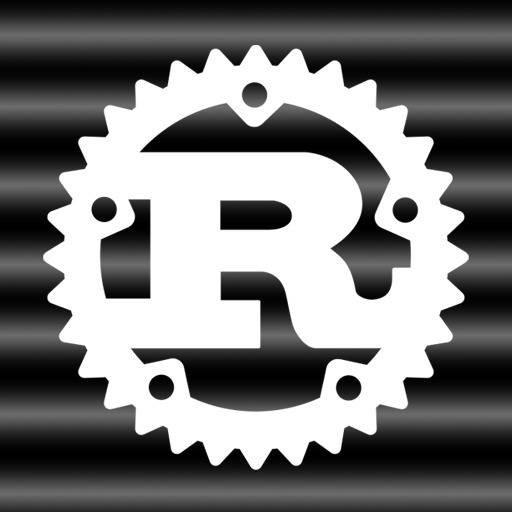
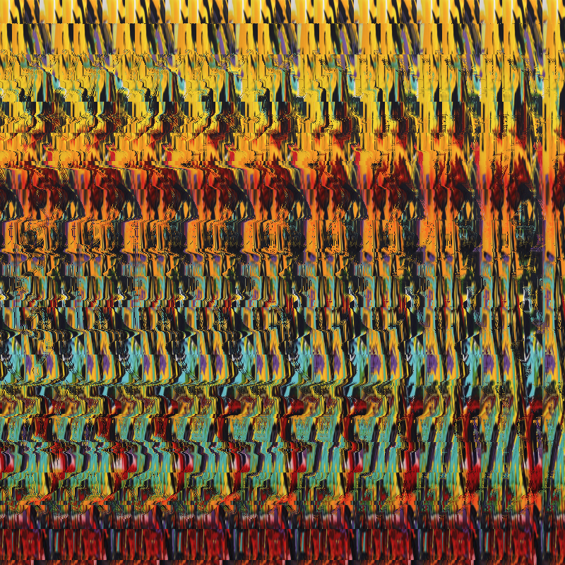
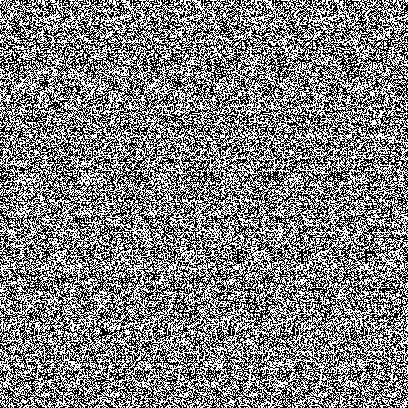

# **Autostereogram generation in Rust.**

Original algorithm proposed in [Displaying 3D Images: Algorithms for
SIRDS](https://www.cs.waikato.ac.nz/~ihw/papers/94-HWT-SI-IHW-SIRDS-paper.pdf) by Harold W. Thimbleby, Stuart Inglis, and Ian H. Witten.

**Autostereograms** are 2D images with a special construct that enable 3D perception illusion. One need to vary the focus distance of its vision in order to see depth.

The two bins `sirds.rs` and `texture.rs` take as input a depth map (here `inputs/depthmap.png`) in grayscale. Values from 0 to 1 are mapped to object depth from far to near field. 

- SIRDS relates to the single image random dot stereogram method
- texture uses an image texture (`inputs/texture.png`)

Below are examples of a depth map and the autostereogram generated with SIRDS and texture methods.

**Depth image:**

**Texture Autostereogram:**  

**SIRDS Autostereogram:**  

