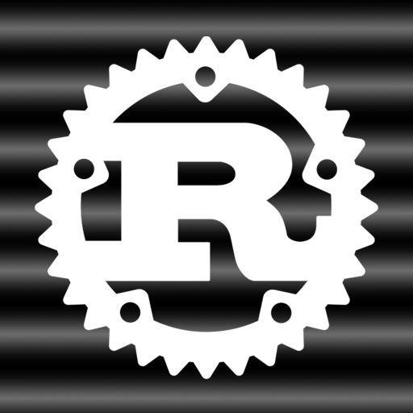
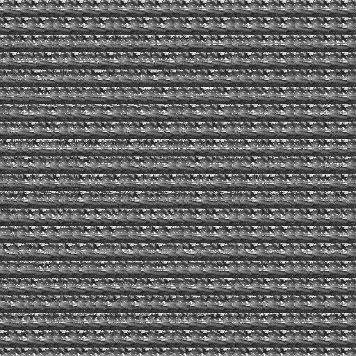

**Autostereogram generation in Rust.**

Original algorithm proposed in [Displaying 3D Images: Algorithms for
SIRDS](https://www.cs.waikato.ac.nz/~ihw/papers/94-HWT-SI-IHW-SIRDS-paper.pdf) by Harold W. Thimbleby, Stuart Inglis, and Ian H. Witten.

**Autostereograms** are 2D images with a special construct that enable 3D perception illusion. One need to vary the focus distance of its vision in order to see depth.

The script `main.rs` takes as input a depth map (here `rust.png`) in grayscale. Values from 0 to 1 are mapped to object depth from far to near field. 

Below is an exemple of depth map and the autostereogram generated.

Depth image:

Autostereogram:
